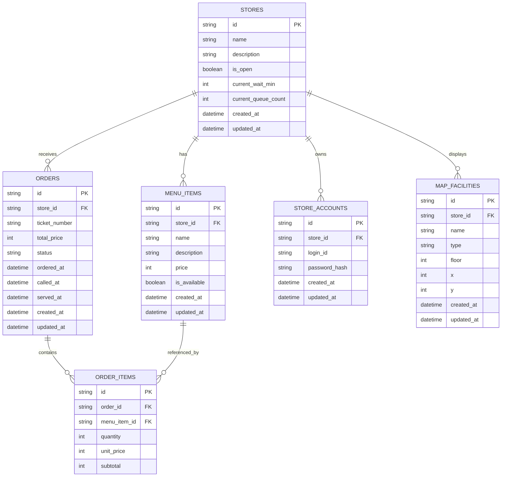

# データベースER図

`docs/database.md` のテーブル定義と、`README.md` / `docs/backend.md` の構成をもとにした ER 図です。

## 補足

- `stores` は店舗・ブースの基本情報と待ち時間を持つ
- `orders` と `order_items` でモバイルオーダーの注文内容を表す
- `store_accounts` は店舗ログイン用の認証情報を表す
- `map_facilities` は校内マップ上に出す施設・ブース位置を表す
