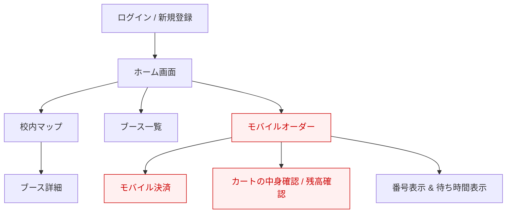
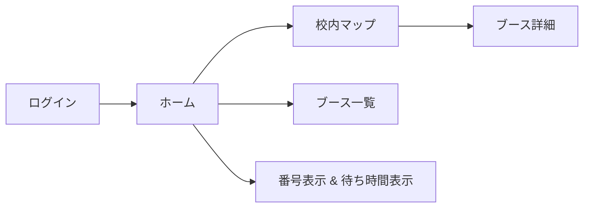
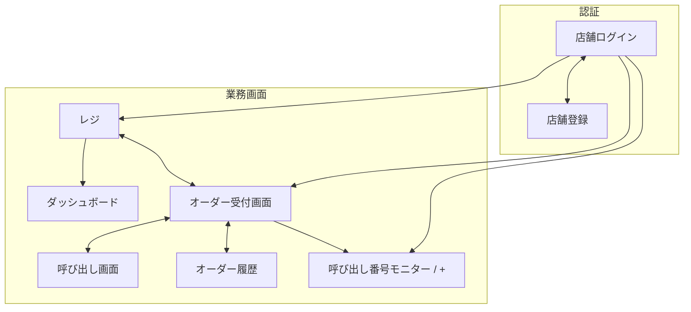
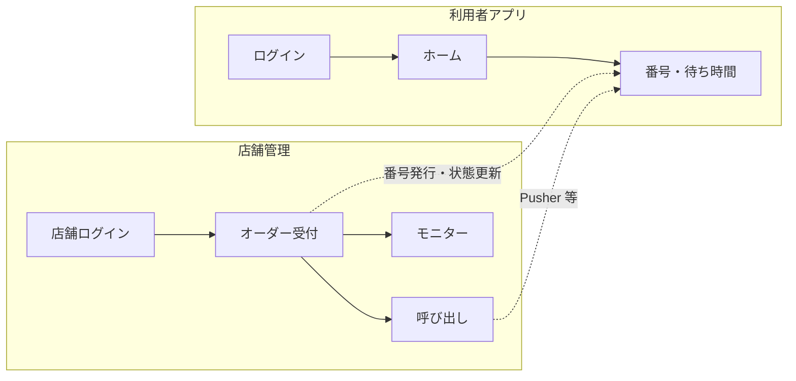

# 画面遷移図

画面遷移の元資料は Excel 上のラフ案。本ドキュメントはその清書版である。

> **凡例**  
> - **赤枠・赤文字** … ver.2 実装予定（元資料の注記「赤文字は ver.2 実装予定」に準拠）  
> - `↔` … 双方向遷移（行き来できる）  
> - `→` … 一方向遷移  

---

## 1. 利用者側（アプリ）

### 画面一覧（利用者）

| 画面 | ver | 概要 |
|------|-----|------|
| ログイン / 新規登録 | 1 | アカウント認証 |
| ホーム画面 | 1 | 各機能へのハブ |
| 校内マップ | 1 | ブース位置の地図表示 |
| ブース詳細 | 1 | マップから遷移するブース情報 |
| ブース一覧 | 1 | 出店ブースの一覧 |
| モバイルオーダー | 2 | アプリからの注文（予定） |
| モバイル決済 | 2 | アプリ決済（予定） |
| カートの中身確認 / 残高確認 | 2 | カート・残高（予定） |
| 番号表示 & 待ち時間表示 | 1 | 呼び出し番号と目安待ち時間 |

### ver.1 での主経路（想定）

店頭で注文・番号発行後、アプリでは **番号表示 & 待ち時間表示** を中心に利用する。モバイルオーダー以降の枝は ver.2。

---

## 2. 店舗側（管理画面）

### 画面内機能（サブ項目）

元資料では **レジ**・**ダッシュボード** の直下に機能が列挙されている。独立画面ではなく、当該画面内の操作・表示項目として扱う。

#### ダッシュボード

| 機能 | 説明 |
|------|------|
| 詳細編集 | ブース情報の更新 |
| 詳細削除 | ブース情報の削除 |
| 待ち人数表示 / +- | 待ち行列の人数表示・調整 |
| 先頭番号 | 現在呼び出し対象の先頭番号 |
| 最新発行番号 | 直近に発行した番号 |
| 目安待ち時間 | 待ち時間の目安表示 |

#### レジ

| 機能 | 説明 |
|------|------|
| メニュー追加 | 商品登録 |
| メニュー削除 | 商品削除 |
| メニュー編集 | 商品更新 |

### 店舗画面一覧

| 画面 | ver | 概要 |
|------|-----|------|
| 店舗ログイン | 1 | 店舗アカウント認証 |
| 店舗登録 | 1 | 新規店舗（ブース）登録 |
| ダッシュボード | 1 | 待ち状況・ブース管理 |
| レジ | 1 | メニュー管理・会計入力 |
| オーダー受付画面 | 1 | 注文の受付・状態更新 |
| 呼び出し画面 | 1 | 番号の呼び出し操作 |
| オーダー履歴 | 1 | 過去注文の参照 |
| 呼び出し番号モニター / + | 1 | 来客向けの番号表示（モニター） |

---

## 3. 全体像（利用者 × 店舗）

店舗で発行した番号・注文状態が、利用者の **番号表示 & 待ち時間表示** に反映される（詳細は `database.md`・`api.md` を参照）。

---

## 4. 改版履歴

| 版 | 日付 | 内容 |
|----|------|------|
| 0.1 | 2026-05-16 | Excel ラフ案をもとに Mermaid で清書 |
